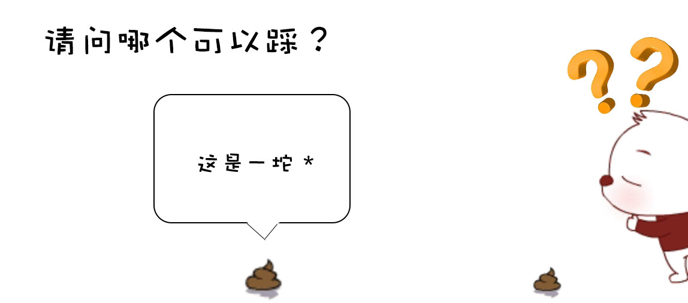
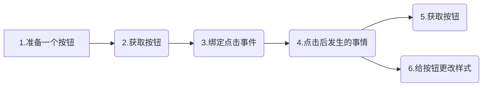
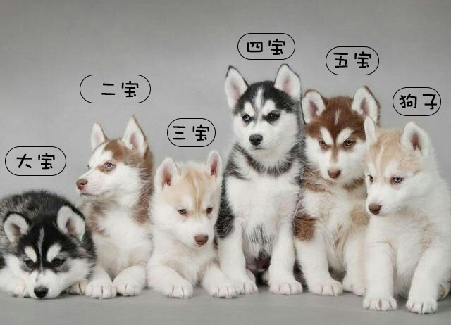
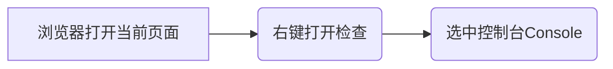

#  JavaScript 基础语法

.jpg)


### JavaScript 应该放在什么位置？

JavaScript 是一门语言，那么如何使用就是很关键的问题！我们应该放在什么位置？

- 行间 JS

  ```html
  <div onclick="alert('我爱JavaScrip！')"></div>
  ```

  - 优势
    - 直接作用于当前元素
  - 劣势
    - 复用率低
    - 结构不够清晰

- 内部 JS 

  ```html
  <script>
  //这里放置js的代码
  </script>
  ```

  - 优势
    - 代码分离清晰
    - 较利于后期修改维护
    - 同页面可以复用
  - 劣势
    - 不同页面无法复用
    - 不同页面修改维护较麻烦

- 外部 JS

  ```html
  <script src="main.js"></script>
  ```

  - 优势
    - 代码分离彻底
    - 利于后期维护修改
    - 不同页面之间也可以复用
  - 缺点
    - 增加请求数量

> 这里我们可以看到和 css 有点像，css 中同样的也是有三种添加方式 (联想记忆更快哦～)，优缺点也


### 注释

① 单行注释

```javascript
//这里是注释内容
```

② 多行注释

```javascript
/*
	这里是多行注释内容
	第二行
	第三行
	···
*/
```


### script标签上的属性

两个我都见过，到底应该写哪个？

```html
<script type="text/javascript"></script>
```

```html
<script></script>
```



<p align="center">加一个标志，并不能改变事物的本质，依旧哪个不能踩</p>

****

**type属性**表示编写代码使用的脚本语言的内容类型（学术语：MIME 类型）。

从 Html5 开始，可以省略，如果是 script 标签，默认为 type = "text/javascript" , 同理 css 也是一样。**但是如果希望向下兼容低版本浏览器，那么建议大家还是加上**。


### 案例

点击一个按钮，让其成为选中状态（选中状态：背景色发生变更）；




### 获取元素

如果有一堆的元素，该如何准确的找到它？



- document.getElementById(' ID ')
  - 通过指定 ID 获取元素；
  - 返回第一个符合条件的元素；
  - 如果找不到匹配项，则返回 `null`；
  - 只有 document 下存在 getElementById ；
- document / parent.querySelector('选择器')
  - 通过指定选择器获取元素；
  - 返回第一个符合条件的元素；
  - 如果找不到匹配项，则返回 `null`；
  - IE8 以下不可以使用；

<p style="color:red;font-weight:bold;">注意！！JS是区分大小写的，所以千万大小写千万不要打错</p>


### 调试

可以利用 console.log( 要打印的内容 )，以此来确认内容是否正确。

**查看console.log内容的步骤**




### script标签最合适的放置位置

页面读到 <body> 标签的时候开始解析页面。当页面结构未生成的时候，在 <head> 标签中的 JS 代码如果获取元素，将获取失败。

**两种解决方案**

1. 在 <head> 中的JS代码，放置在 window.onload（等待窗口加载完成） 事件中。
2. 放在 </body> 标签前，让 HTML 结构先行加载完成。

**注意事项**

如果 JS 的代码比较庞大，需要较长的时间读取，会影响页面的加载，造成页面长时间空白。

从用户体验的角度来说，我们应该避免这样的情况，长时间空白会让用户觉得打开速度很慢，从而造成用户流失。


### 给元素绑定事件

```javascript
ele.onclick = function(){
    //点击后要做的事情
};

/*
    元素.事件 = function(){
        //点击后要做的事情
    };
*/
```

- ele —— 需要绑定事件的元素
- onclick —— 点击事件


### 操作元素的样式

```javascript
ele.style.background = 'red';

/*
	元素.样式.样式名 = '值';
*/
```

- ele —— 需要改变样式的元素
- style —— 样式
- background —— 具体的样式名背景
- red —— 样式名对应的值，<mark>需要加上 ' ' (引号) </mark>


