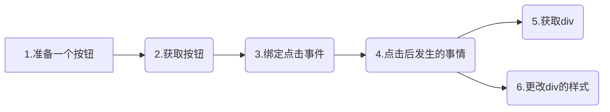

# 变量

.jpg)

我今年要去<mark>黄台甫马哈那坤弃他哇劳狄希阿由他亚马哈底陆浦欧叻辣塔尼布黎隆乌冬帕拉查尼卫马哈洒坦</mark>旅游，据说<mark>黄台甫马哈那坤弃他哇劳狄希阿由他亚马哈底陆浦欧叻辣塔尼布黎隆乌冬帕拉查尼卫马哈洒坦</mark>很好玩，还有很多好吃的。<mark>黄台甫马哈那坤弃他哇劳狄希阿由他亚马哈底陆浦欧叻辣塔尼布黎隆乌冬帕拉查尼卫马哈洒坦</mark>的小姐姐也都超级好看。我朋友之前去了<mark>黄台甫马哈那坤弃他哇劳狄希阿由他亚马哈底陆浦欧叻辣塔尼布黎隆乌冬帕拉查尼卫马哈洒坦</mark>，他说不虚此行。我很期待！

---


#### 什么是变量？

变量用于存储数据。

**如何使用变量？**

在使用变量之前，我们需要先创建变量。

**声明变量步骤**

- 使用关键字声明变量（关键字：js中定义好的有一定特殊含义的单词）
  - var
- 准备一个变量名

```javascript
var a; //声明一个名字为 a 的变量

/*
	var 变量名；
*/
```

**对变量进行赋值**

```javascript
a = 10;
/*
	变量名 = 数据   ---》  这个过程叫做赋值
	当我们需要用到 10 的时候，就可以使用 a 代替
	
	10 * 10 ---》  a * a
*/
```

**合并 声明 和 赋值 两个步骤**

```javascript
var a = 10; 
/*
	var 变量名 = 数据 ;
*/
```

<mark>当只声明变量，没有赋值的时候，默认值为undefined</mark>


#### 利用变量巧妙简化旅游地方

```javascript
var 曼谷 = "黄台甫马哈那坤弃他哇劳狄希阿由他亚马哈底陆浦欧叻辣塔尼布黎隆乌冬帕拉查尼卫马哈洒坦";
```


### 案例

点击一个按钮，更改div的宽、高、背景色、边框，利用变量简化。




#### 变量的好处

 - 简化代码，增强可读性
 - 可以复用


#### 变量命名规则

名字也不可以随随便便取哦～，像是 id 和 class 的命名一样，变量名也有属于自己的规则。

- 不允许数字开头
- 不允许使用关键字和保留字
- 允许是字母，数字，下划线(_)，美元符($)任意组合而成

**如果不符合规范将出现如下报错信息：**

<p style="color:red;">Uncaught SyntaxError: Invalid or unexpected token</p>

语法错误：标记无效或意外


#### 关键字和保留字

- 关键字：https://developer.mozilla.org/zh-CN/docs/Web/JavaScript/Reference/Lexical_grammar#%E5%85%B3%E9%94%AE%E5%AD%97
  - 当前语法中正在使用的单词	
- 保留字：https://developer.mozilla.org/zh-CN/docs/Web/JavaScript/Reference/Lexical_grammar#%E6%9C%AA%E6%9D%A5%E4%BF%9D%E7%95%99%E5%85%B3%E9%94%AE%E5%AD%97
  - 将来可能在语法中使用的单词

####  

#### 变量的命名风格

- 具有语义化（语义化：一看就知道是什么）
- 驼峰命名
  - 大驼峰
    - JavaScript
  - 小驼峰
    - javaScript


#### 多变量同时声明

使用逗号对变量名进行间隔，只需要一个关键字var。

```javascript
var a = 10,
    b = 20,
    c = 'Hello';
```


#### 变量名掌握测试


① 将下列不符合命名规则的挑选出来，并写出不符合哪条规则，最后将其修改为正确的。

A : var this = 10;

B : var For = 10;

C : var _num = 10;

D : var 变量  = 10;

E : var $total = 10;

F : var 9all = 10; 

G: var background-color = 'red';


② 写出下列变量的打印结果

```javascript
var v1,v2,v3 = 'hello',
    v4 = 42,
    v5;

console.log(v1);
console.log(v2);
console.log(v3);
console.log(v4);
console.log(v5);
```


答案：

**A、F、G**


- undefined
- undefined
- hello
- 42
- undefined

