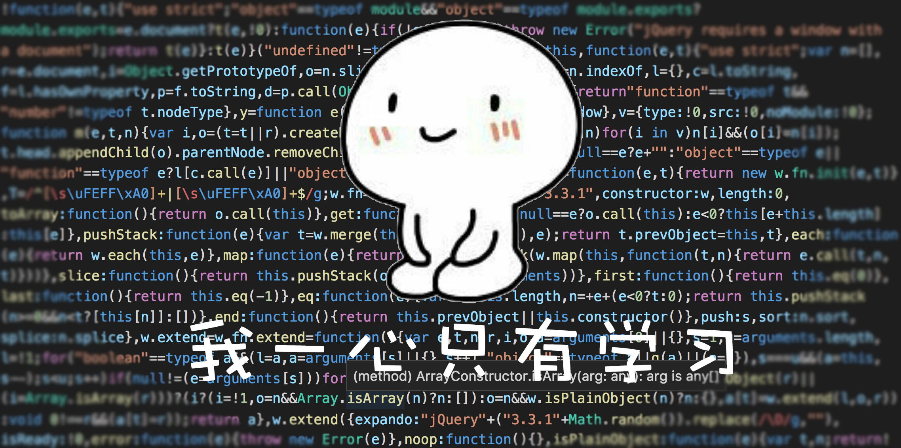
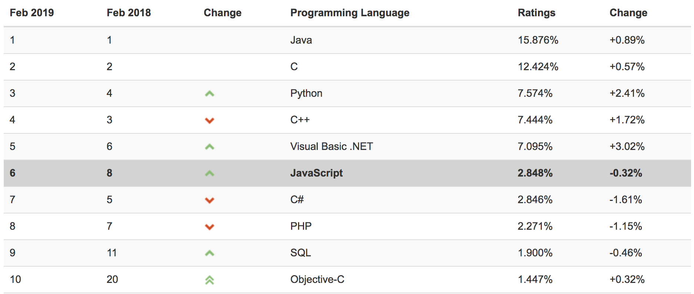
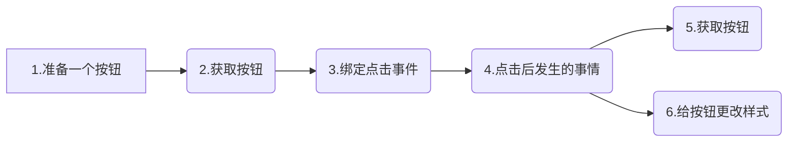

# 初步认识 JavaScript

在互联网的江湖中，门派林立、各怀绝技、人才辈出，那是一个看不见硝烟的战场，是一个可以说很久很久的故事。今天我们就来说一个前端重量级门派——JavaScript。

### JavaScript简介

JavaScript 是一门脚本语言。计算机中其实有很多的语言，总体我们分为以下几类：

 - 汇编语言
 - 脚本语言
 - 机器语言
 - 高级语言

脚本语言的特点：对比其他类型语言编程速度更快，不需要编译、简单、易学、易用、灵活性高。当然这样的高灵活性是有牺牲的，运行速度可能更慢，运行时更消耗资源。

而JavaScript就是脚本语言中的一种，被广泛应用于Web应用开发,常用来为网页添加各式各样的动态功能，可以看到的是，它在全球语言排行中都十分能打。

该数据为2019年最新数据（基于互联网有经验的程序员、课程和第三方厂商的数量，排名使用著名的搜索引擎​）

### JavaScript可以做什么？

我们上面说到JS可以应用于Web开发，常常用来为网页添加各式各样的动态功能。那到底什么样的功能我们可以用JS来完成呢？下面准备了几个知名度极高的网站，我们来看一下：

- 天猫： https://www.tmall.com/
  - 搜索功能
  - 返回顶部功能
  - 模块快速索引功能
  - 登陆后才可进入购物车
  - 登录验证
- 爱奇艺：http://www.iqiyi.com/
  - 点赞和踩
  - 部分功能必须登录
  - 返回顶部
  - 导航大图切换
  - 搜索功能
  - 登录验证
- 飞猪：https://www.fliggy.com/
  - 设定单程和往返
  - 日期选择的时候，今天之前的不可以选择
  - 不一样的地方，不一样的支付价格
  - 必须的勾选上后，才可以加入购物车

### Web中哪些时候需要用到？

- 行为交互
- 数据交互
- 逻辑交互

### JavaScript组成

- ECMAScript：JavaScript语法和基本对象
- DOM：文档对象模型
- BOM：浏览器对象模型

### 案例

点击一个按钮，让其成为选中状态（选中状态：背景色发生变更）；

