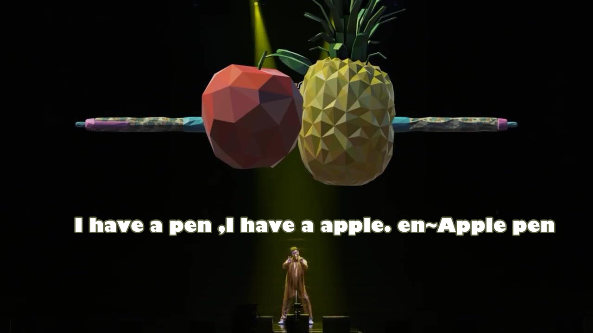
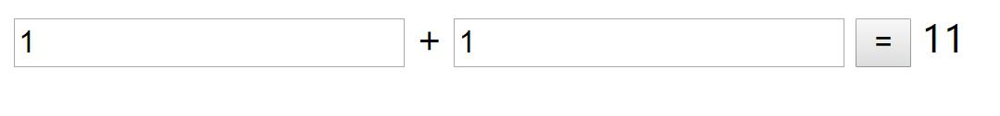
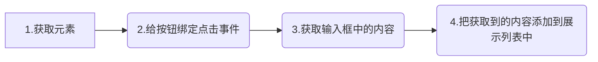

# 神奇的加号




### 简易计算器



咦？到底发生了什么? 难道我的计算器坏了？？？？？

1 + 1 = 11 ？ 是怎么做到的？ 赶紧来看一下问题的产生~


```javascript

alert( 1 + 1 ); //2
alert( '1' + 1 ); //11
alert( '1' + '1' ); //11

```


### 加号的作用

① 数学运算：做数字相加运算

② 字符串连接：将加号左右两边的内容拼接，然后返出


### 字符串

由一对双引号 或 单引号包起来的0个或多个字符组成的串

### typeof检测数据是不是字符串

```javascript
var a = '123';
typeof a; //string
```


### 重点总结：

当加号的左右任何一侧，有字符串，那么作为连接符使用

如果两边都是数字，作为加法运算使用


### 案例：留言板


一个熟悉的不能再熟悉的功能，随便举个例子都是一堆的，像是平时看知乎、刷微博、论坛灌水都少不了留言板的存在~

这样一个常见的功能，我们今天就已经可以来实现啦！是不是很开心 ~ 我们来看下，如何做。


**思路分析**

- 材料准备
  - 一个输入框
  - 一个按钮
  - 一个展示留言的列表
- 当点击按钮的时候，讲输入框的内容添加到留言列表结构中





###  += 的使用

A = A + B      ==>       A += B  

**这里需要额外注意，字符串拼接的情况下，A 和 B 的顺序是不能颠倒的**