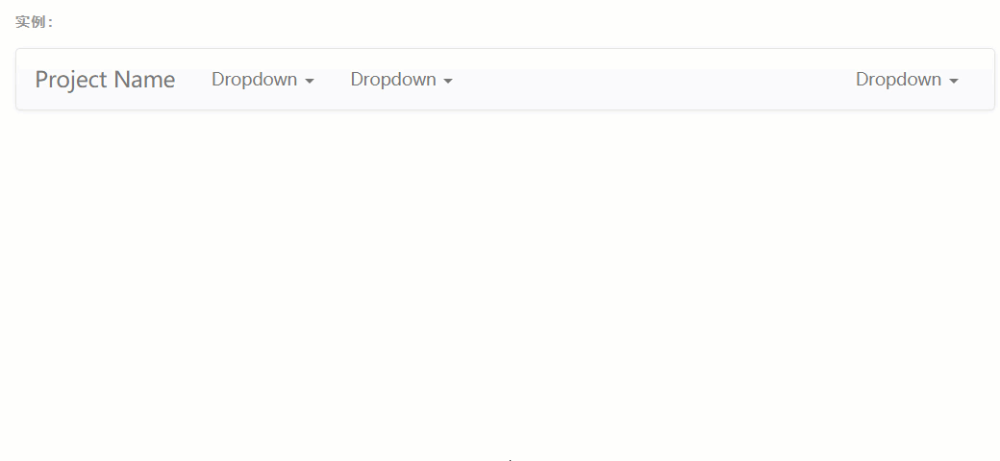
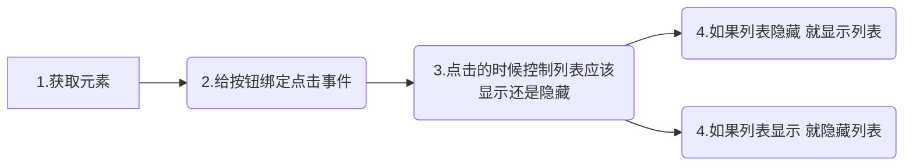

# if 语句和布尔值


很多时候，我们往往会遇到需要在多者之间做选择的情况，例如抛硬币~正面吃糖果，反面那就巧克力吧~

程序中我们也时常要做这样的选择，例如~


#### 演示案例



点击一下展开，这是我们在一开始学习 js 的时候就接触过的案例。

那如果稍稍复杂一点~第一次点击的时候是展开，第二次点击的时候收起，循环往复，实现一个下拉菜单效果，这个怎么做呢？？


## if 语句语法

①  最简单的，只有“如果”

```javascript
if( 判断条件 ){
   //当满足判断条件后，执行这里的代码
}
```


② 中级的，“如果....否则”

```javascript
if( 判断条件 ){
   //当满足判断条件后，执行这里的代码
}else{
    //否则，执行这里的代码
}
```


③ 高级的，“如果...或者如果....或者....否则”

```javascript
if( 判断条件1 ){
    //当满足判断条件1后，执行这里的代码
}else if( 判断条件2 ){
    //当满足判断条件2后，执行这里的代码
}else if(判断条件3){
    //当满足判断条件3后，执行这里的代码
}else{
    //不满足以上条件的执行这里的代码
}
```


**注意事项**

 	1. 判断条件可以有多个
 	2. 可以只有 if 没有 else 


### 比较运算符和逻辑运算符

**比较运算符**

- 5 > 10                 大于
- 5 < 10                 小于
- 5 == 10              等于


<P style="color:red;"> A == B : 比较等号左右两边的值是否相等，如果相等返回true，否则返回false；</p>

****

**逻辑运算符**

- 5 < 10  &&  2 < 3

- 5 > 10 ||  2 > 3


<p style="color:red;">A && B：如果左侧的结果为true，则返回右侧的结果。如果左侧为false，直接返回左侧。</p>

<p style="color:red;">A || B：如果左侧的结果为true，则返回左侧的结果。否则返回右侧结果。</p>


### 判断条件 之 布尔值

- true - 真
- false - 假

判断条件的小括号：程序会将括号内的判断条件转为 true 或 false，然后交给if去做判断。


### 案例步骤



<P style="color:red;">列表的显示隐藏可以根据 display 的值来决定</P>


### 作业

自定义下拉菜单


