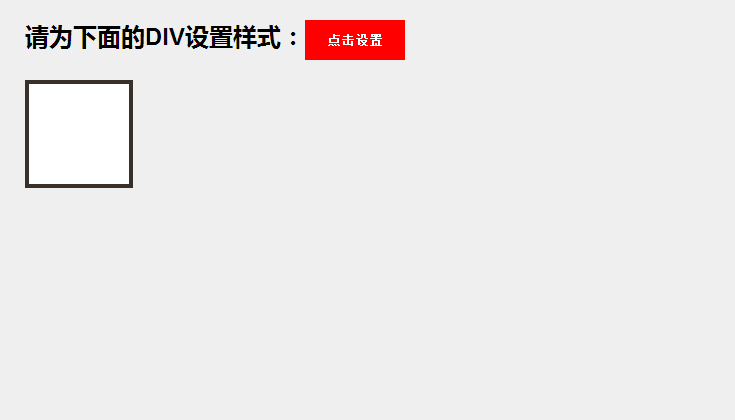

# JS 属性操作

.jpg)

### 什么是属性？

属性就是人类对于一个物体抽象方面的刻画。

例如我们说一个小姐姐好看。好看的概念是比较抽象的，那么哪些方面让你觉得这个小姐姐好看呢？

- 大大的眼睛
- 长长的头发
- 弯弯的眉毛
- 瘦瘦的，看起来100斤左右
- 皮肤很白
- 牙齿很整齐

通过以上的这些描述，我们的脑海中就会对这个小姐姐有一定的刻画，那么这些就是属性。


### JS 中两种操作属性的方法

- 点 - .
  - 元素 . 属性
- 方括号 -> [ ]
  - 元素 [' 属性 ']


<p style="color:red;font-weight:bold;">方括号中可以填入需要计算的东西，或者不符合标识符规范的!</p>


### JS 的读与写操作

```javascript
ele.style.background;  //读

ele.style.background = 'red'; //写
```


### 常用属性

- id
- className
- value
- style
  - background
  - color
  - width
  - height
  - cssText
- innerHTML
- href
- src
- tagName


### 属性操作时的注意事项及常见问题


- href 值和 src 值获取到的是绝对路径
- style 是行间属性
- cssText 会替换掉当前所有的行间属性
- class 是关键字，改成 className
- tagName 获取到的是大写字母


### 作业：DIV




