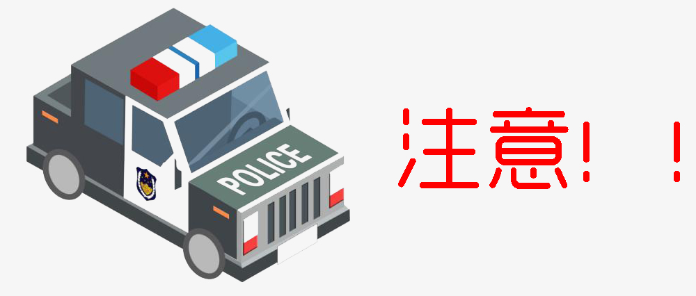

# 定时器的问题



定时器虽好，注意事项也不少哦~


**注意事项**

1. 定时器里面的this指向

```javascript
btn.onclick = function(){
    setTimeout(function(){
        console.log(this); //window
    },1000)
}
```


2. 一个参数不推荐使用字符串

```javascript
setTimeout('fn()',1000);
function fn(){
    console.log('不推荐使用')
}
```

**需要解析两次才可以执行**（影响性能，不推荐使用，并且存在xss注入风险）

- 作为字符串进行解析
- 作为函数进行解析


3. 第二个参数：time，是可选参数，如果不填默认为0，但是代码其实并不会立即执行（>=4ms）

```JAVASCRIPt
for(var i=0;i<5;i++){
    setInterval(function(){
        console.log(i);//5 5 5 5 5 
    },0)
}
```


4. 第三个参数开始可作为第一个function的参数，但是在IE9及以下不支持第三参数及它后面的参数

```javascript
//解决方法1
setTimeout('fn(param1,param2)',1000)

function fn(x,y){
    console.log(x + y);
}

//解决方法2
setTimeout(function(){
    fn(param1,param2);
},1000)

//解决方法3
setTimeout(fn(param1,param2).bind(null,1,2),1000);

```
