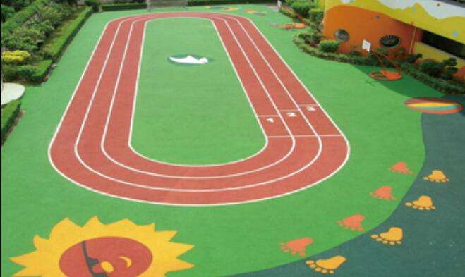

# 流程控制语句——循环结构




#### for 循环

```javascript
for(初始化;循环条件;变更条件){
    //满足循环执行的代码...
}
```

### for ... in循环

```javascript
for(var key in obj){
    //这里的key指的就是对象下的属性
}
```

### while（前测试循环语句）

```javascript
while(判断条件){
    //需要循环的代码
}
```

### do while（后测试循环语句）

```javascript
do{
	//需要循环执行的代码
}while(
	//判断条件
)
```


### break 和 continue

**break**（打破）

- 终止当前循环，包括break后面的代码也会被停止执行，并且跳出该循环。

**continue**（持续）

- 终止当前循环，包括continue后面的代码也会被停止执行，但是不跳出循环，循环会在这次之后，继续执行。


