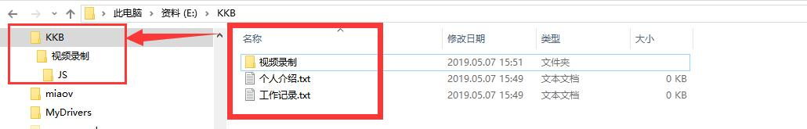
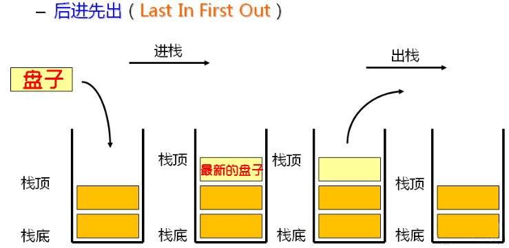
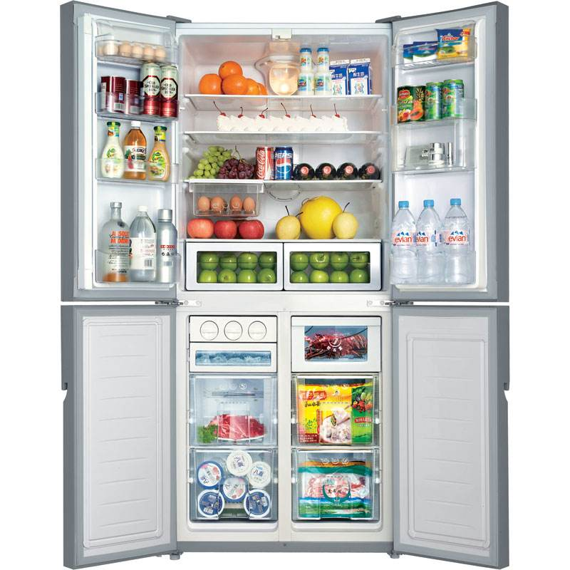
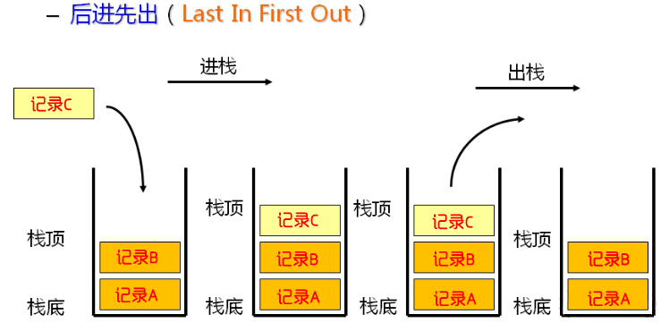
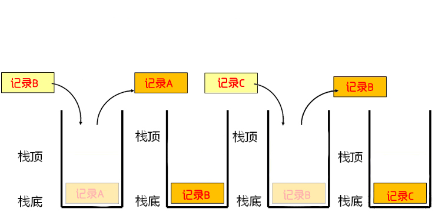

# 递归

### 什么是递归？

- 在函数内部调用自己。



> 请问KKB这个文件夹下面一共有多少文件？


### 递归的执行流程——栈

**递归递归，有去有回。**

>1. 打开百度
>2. 搜索递归
>3. 点开一篇递归的文章
>4. 出现名词“栈”
>5. 打开百度
>6. 搜索“栈”
>7. 点开一篇栈的文章
>8. 出现名词”内存“
>9. 打开百度
>10. 搜索“内存”
>
>.....
>
>11. 了解内存（1）
>12. 了解栈（2）
>13. 了解递归（3）


#### 栈

- 数据存储结构，这些数据都被放在内存中。
- 特点：先进后出

> 餐厅洗盘子，总是把刚洗好的放在最上面，最先放的在最下面
>
> 取盘子时候，从最上往下拿取




- 这里我们用于存储函数调用的记录，**但是栈的大小并非无限的，过多的内容会导致严重的性能问题，甚至栈溢出**


**调用记录**

执行函数时候的一些信息：例如函数中的局部变量、函数的位置信息等...


#### 内存

存储数据的地方，但是不同的数据需要以不一样的形式进行存储。

> 例如冰箱我们可以放食物，但是冰箱也分为冷藏区和冷冻区。
>
> 冷藏区：蔬菜、饮品
>
> 冷冻区：雪糕、速冻饺子




### 递归的优化——尾递归

#### 尾调用

- 在一个函数执行的最后一步，是调用函数。

```javascript
function fn(){
    console.log(1);
    fn1()；
}
```


**以下情况不属于尾调用**

```javascript
function fn(){
   fn1();
   console.log(1);
}

function fn(){
    return fn1() + 1;
}
```

- 情况一

> 最后一个执行的是 `console.log()`;

- 情况二

> 最后一个执行的是：拿到`fn1`的返回值之后 +1；


**尾调用不一定需要出现在代码的最后，必须是最后一个执行的**

```javascript
function fn(){
    if(true){
        fn1();
    }else{
        fn2();
    }
}
```


#### 尾调用优化原理

函数执行的时候，会生成一个“调用记录”以栈的数据形式存放到内存中，多了以后就会产生溢出问题。我们可以利用尾调用优化。




**下图为利用尾调用优化后的栈存储**



- 栈内只会存在当前函数的“调用记录”，由于尾调用是最后一步，后续不再用到当前函数内的变量、位置等信息，所以可以销毁。


#### 尾递归

- 一个函数的执行的最后一步，是调用自己本身。

**乘阶案例：1\*2\*3\*4\*5**

```javascript
//普通递归
function fn(n){
    if(n===1){
        return 1;
    }
    return n * fn( n-1 );
}

//尾递归
function fn(n,total){
    if(n === 1){
        return total;
    }
    return fn(n-1,n*total)
}

```

**注：es6才实现了尾递归优化，但是必须是在严格模式下**