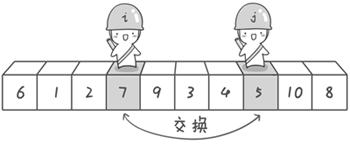
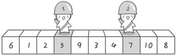
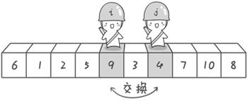
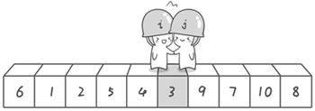
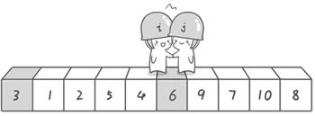

# 冒泡排序

```javascript
var arr = [10,4,13,8,7,1];
```

1. 通过循环数组中的值，比较相邻的两个位置的值：
   如果前面的大于后面的，就交换位置，通过这样的方式我们可以得到当前数组中的最大值（也可以是最小值）；

2. 重复第一个过程，直到左右的值都不发生交换了，停止比较；

3. 最终将得到一个从小到大（从大到小）排列的数组；

   


动画网址：http://www.webhek.com/post/comparison-sort.html


# 快速排序













1.设置一个基准值（一般都是数组中的第一个值）

2.设置两个变量指针（i和j），分别在数组的头和尾的位置

3.比较i指针的值 和 基准值，如果小于基准值，i往前走 ++，直到遇到比基准值大的值停止，执行下一步

4.比较j指针的值 和 基准值， 如果大于基准值，j往后走 --，直到遇到比基准值小的值停止，执行下一步

5.交换当前 i 和 j 所在的位置的值

6.重复 3、4、5过程，直到 i 和 j 相遇，调整基准值的位置

7.根据基准值的位置，分为左右两侧，左边重复以上1-6步骤，调整完所有顺序后，右侧重复1-6步骤